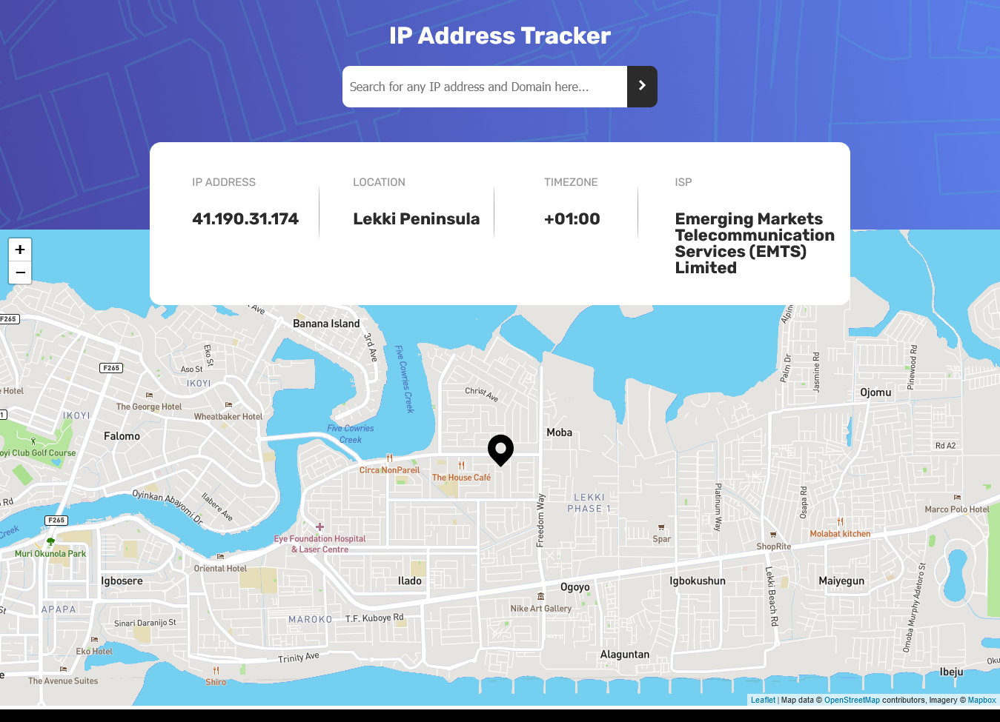
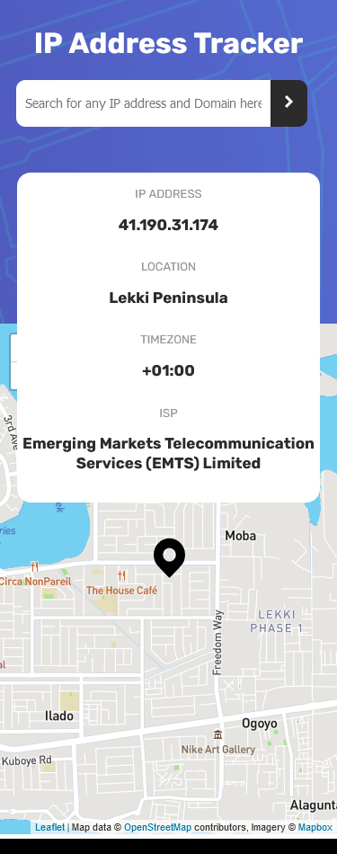

# Frontend Mentor - IP address tracker solution

This is a solution to the [IP address tracker challenge on Frontend Mentor](https://www.frontendmentor.io/challenges/ip-address-tracker-I8-0yYAH0). Frontend Mentor challenges help you improve your coding skills by building realistic projects. 

## Table of contents

- [Overview](#overview)
  - [The challenge](#the-challenge)
  - [Screenshot](#screenshot)
  - [Links](#links)
- [My process](#my-process)
  - [Built with](#built-with)
- [Author](#author)

## Overview

### The challenge

Users should be able to:

- View the optimal layout for each page depending on their device's screen size
- See hover states for all interactive elements on the page
- See their own IP address on the map on the initial page load
- Search for any IP addresses or domains and see the key information and location
- Display error once there's one

### Screenshot

### Links

- Solution URL: [Github url](https://github.com/muakone/ip-address-tracker.git)
- Live Site URL: [git pages](https://muakone.github.io/ip-address-tracker)

## My process

### Built with

- Semantic HTML5 markup
- CSS custom properties
- Flexbox
- CSS Grid
- Mobile-first workflow
- [React](https://reactjs.org/) - JS library
- [IP Geolocation API by IPify](https://geo.ipify.org/) - IP-Adrress & domain API
- [LeafletJS](https://leafletjs.com/) - Map API
- [Mapbox](http://www.mapbox.com/) - Map Navigation

## Author

- Website - [Muak1](https://muakone.github.io/ip-address-tracker)
- Frontend Mentor - [@muak](https://www.frontendmentor.io/profile/muak)
- Twitter - [@Muhiz_akanni](https://www.twitter.com/Muhiz_akanni)

